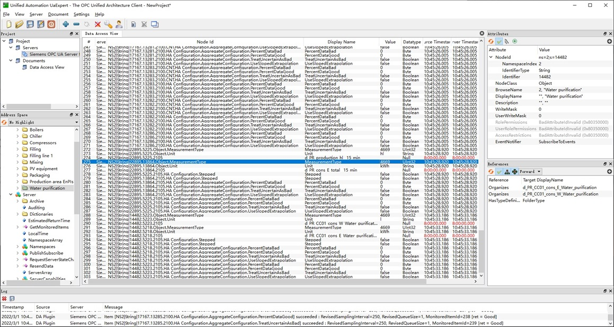

# EnMPRO7.2 集成方案调研和风险分析 #
应Fan Lei要求MAC 完成了集成EnMPRO SCADA 软件的调研。

## 北向 OPCUA 暴露方式 ##
按照上周三Lei Gong 给出的指南和Wen Kui 提供的虚机在局域网中可以暴露出项目Production 点位。关键步骤在于虚机的IP 组网方式和OPCUA 签名文件的信任。这种方式下借助UaExpert 可以访问系统
- Boiler
- Chiller
- Compressor
- Filling
- PV
- Packaging
- Water Purification
点位，具体点位列表参考  。
kWh 电度量的数据类型在EnMRPO 里定为UINT32类型也就是整形。

## 风险1 关于DOUBLE 类型数据点 ##
EMS 能管软件主要的表计输入电度变量走DOUBLE 格式（64位）但是在EnMPRO 里未查到modbus driver 支持该类型。通过配置界面看到支持float 类型（32位）。实际该虚机内demo 项目数据点位也没有检索到DOUBLE 类型数据。

## 风险2 南向怎么接入EP/DG 表计 ##
现在的试验里我们将ENMPRO 看成黑盒，期望SCADA 取到南向表计的数据。北向通过OPCUA 暴露这条路线没有问题； 而如果SCADA 无法驱动目前系统的表计则EMS 软件对这些点位就无能为力。

## 进一步测试 ##
如果DI 同事能提供一个南向连接实物的测试环境将极大加速确定技术风险。需要项目经理协调。技术细节可以联系SI MAC Cao Lei 或者Gao Fei.