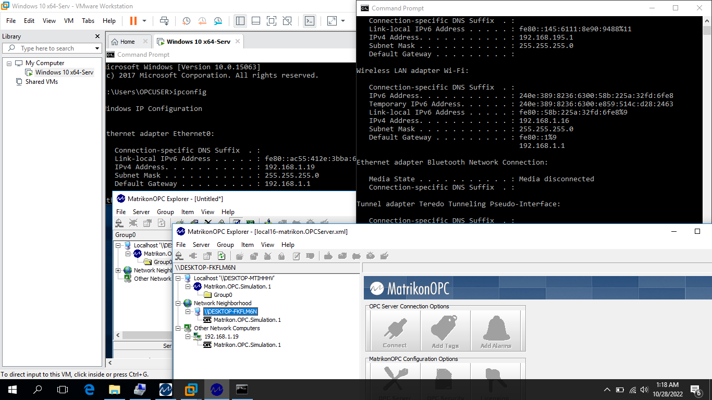
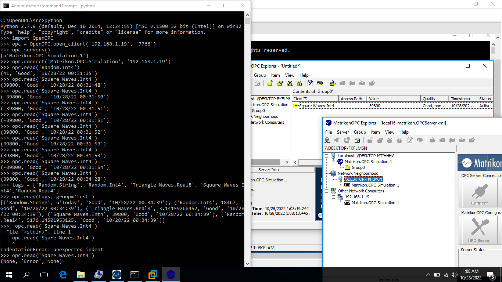

# 调研目标 #
OPC-DA 客户端软件开发。功能包括数据采集，返写，枚举和递归tag树，属性，订阅。

## 服务器和客户端软件 ##
经过调研，server 软件选用了老牌Matrikon OPC SERVER SIMULATION FOR TEST 试用软件。客户端暂时利用了一个开源的python2.7 开源软件OpenOPC1.3.

## 搭建DA 服务器 ##
必须利用Windows7 或者老版本Windows 10, 因为新版Windows 10 改变了DCOM+ 的驱动签名而无法用。winver 版本< 1909. 利用了vmw以及虚拟机进行实验室验证。服务器设置有以下要求：
软件包和运行时depends 的安装
+ 依赖库和运行时的防火墙规则
+ 本地安全策略
+ 默认OPC 用户创建和鉴权选项
+ DCOM 属性安全策略
+ 本地安全策略

安装完成后，利用group 和tag 功能增加服务器的数据点，例如设定REAL8 和int4 变量，并设定1000ms 变化周期。可以利用Matrikon 集成的客户端进行测试。在该软件中称为Explorer。 不出意外的话安装和配置完成能够用服务器自带的Explorer 读取本机服务器Simulator 点位，并能返写。到这一步证明本机COM 的服务器运作正常，可以在本机调试Python 程序。完成客户端和服务器部署在同一台机器上的测试后可以在局域网中一台远程客户端上开发异地的DCOM 的数据采集和函数指令调用程序。但是因为涉及到DCOM 的配置，DA 驱动库， 开发环境的dll 集成调用，因此过程会有一点复杂。以下从这个逻辑开始进行介绍。

## 从源代码运行OPC-DA Client ##
+ 下载python2.7.9.msi 32bit版本 安装
+ 下载pyro3.16 安装
+ 下载OpenOPC 1.3.1安装（必须无报错，）
+ 运行前，pip下载pywin32==2.19 依赖库安装
+ OS 环境变量OPC_MODE = open
+ 进入openopc 安装目录的src 子目录，修改opc.py 服务器和客户端host地址为计算机IP 地址； 利用console 运行 python opc.py -r "Random.Real8" -L 1 测试客户端代码和功能逻辑。
因为OpenOPC 软件包底层调用的是PLE for Process Control基金会的6个dll。而这些古老的驱动库为32位编译结果，因此调用环境必须适配到32 bit。开发环境包括了Pywin32 以及Pyro，这两者必须同时为32位程序。如果通过网络上提供的pip site package安装指令不容易控制安装包版本和系统兼容情况，例如github 讨论区提供的一个例子
```
pip install pywin32==224
pip install pyro==3.16
```
一些古老的package 的新版本可能已经不被pip install 所支持。因此，更为稳妥的办法是直接从官网下载pywin32以及pyro 32bit 版本安装包，或者利用'python setup.py build && python setup.py install' 从源码安装。

### 关于Python3.x ###
OpenOPC release了基于[3.x新语法的OPC 驱动库](https://pypi.org/project/OpenOPC-Python3x/)，例如可以借助'pip install OpenOPC-Python3x==1.2.2' 安装[特定版本](https://github.com/ya-mouse/openopc/issues/9)。
```
Python 3.6.8 32-bit
Pyro4==4.55
pywin32==224
```
但是无法调通。

## 开发 ##
最难的是第一步：连接服务器；根据文档说明，OpenOPC 可以工作在2 种模式：
+ dcom 
+ open

可以通过代码或者"系统环境变量"设定。不同模式区别在于调用的dcom 驱动库、函数接口、环境安全设置。服务器和客户端部署在同一台机器时无论采用哪种连接都能连通；服务器和客户端部署在局域网不同机器上时必须采用open 模式- 借助Python 的win32 接口调用系统DCOM 服务。众所周知跨机器的DCOM 配置是出名的困难- 两台机器必须设置相同用户名和密码以及组件服务，针对OPC服务设置本地安全策略，防火墙规则，凭据管理。实际调试可以先测通dcom 模式，如下代码打通了服务器连接（本机 URI = localhost），展示服务器版本信息，列出服务器运行实例，读取点位，写入点位，显示tag 列表，递归展示tag 层级，建立group，访问group，删除group，关闭连接。

```
import OpenOPC
opc = OpenOPC.client('localhost')
opc.connect()
opc.servers()
opc.read('Random.Int4')
for name, value, quality, time in opc.iread( ['Random.Int4', 'Triangle Waves.Real8'] ):
   print name, value
opc.remove(opc.groups())
opc.write( ('Square Waves.Int8', 39800) )
opc.properties('Random.Int4', id=1)
opc.list()
opc.list('Simulation Items.Random')
opc.info()
opc.close()
```

重头戏在访问的服务器位于局域网中另外一台计算机时，必须[开放DCOM 访问系统权限](原文链接：https://blog.csdn.net/steventian72/article/details/104039459)，设置双方的OPC 工作模式=open（必须在Windows 环境变量中设置OPC_MODE 为'open', 客户机的OPC_HOST 设置为服务器的主机名或者IP 地址）

## 测试报告（远程服务器版） ##
以下测试客户端和服务器基于 Windows 10 1703 ver 并安装了环境
```
Python2.7.9 32 bit
OpenOPC 32 bit 1.3.1
Matrikon OPC Server for Simulation 1.5
```
测试结果

```
C:\OpenOPC\src>python
Python 2.7.9 (default, Dec 10 2014, 12:24:55) [MSC v.1500 32 bit (Intel)] on win32
Type "help", "copyright", "credits" or "license" for more information.
>>> import OpenOPC
>>> opc = OpenOPC.open_client('192.168.1.19', '7766')
>>> opc.servers()
[u'Matrikon.OPC.Simulation.1']
>>> opc.connect('Matrikon.OPC.Simulation', '192.168.1.19')
>>> opc.read('Random.Int4')
(41, 'Good', '10/27/22 23:52:16')
>>> opc.read('Random.Real8')
(9406.816673070001, 'Good', '10/27/22 23:53:21')
>>> tags = ['Random.String', 'Random.Int4', 'Triangle Waves.Real8', 'Square Waves.Int4','Random.Real4']
>>> opc.read(tags, group='test')
[('Random.String', u'Today', 'Good', '10/27/22 23:54:56'), ('Random.Int4', 6334, 'Good', '10/27/22 23:54:56'), ('Triangle Waves.Real8', 3.14159268452, 'Good', '10/27/22 23:54:56'), ('Random.Real4', 21655.80078125, 'Good', '10/27/22 23:54:56')]
>>> opc.read(group='test')
[('Random.String', u'Today', 'Good', '10/27/22 23:54:56'), ('Random.Int4', 6334, 'Good', '10/27/22 23:54:56'), ('Triangle Waves.Real8', 3.14159268452, 'Good', '10/27/22 23:54:56'), ('Random.Real4', 21655.80078125, 'Good', '10/27/22 23:54:56')]
>>> opc.read(group='test')
[('Random.String', u'Today', 'Good', '10/27/22 23:54:56'), ('Random.Int4', 6334, 'Good', '10/27/22 23:54:56'), ('Triangle Waves.Real8', 3.14159268452, 'Good', '10/27/22 23:54:56'), ('Random.Real4', 21655.80078125, 'Good', '10/27/22 23:54:56')]
>>> opc.read(group='test')
[('Random.String', u'Today', 'Good', '10/27/22 23:54:56'), ('Random.Int4', 6334, 'Good', '10/27/22 23:54:56'), ('Triangle Waves.Real8', 3.14159268452, 'Good', '10/27/22 23:54:56'), ('Random.Real4', 21655.80078125, 'Good', '10/27/22 23:54:56')]
>>> opc.read(group='test')
[('Random.String', u'Today', 'Good', '10/27/22 23:54:56'), ('Random.Int4', 6334, 'Good', '10/27/22 23:54:56'), ('Triangle Waves.Real8', 3.14159268452, 'Good', '10/27/22 23:54:56'), ('Random.Real4', 21655.80078125, 'Good', '10/27/22 23:54:56')]
>>> opc.read(group='test')
[('Random.String', u'Today', 'Good', '10/27/22 23:54:56'), ('Random.Int4', 6334, 'Good', '10/27/22 23:54:56'), ('Triangle Waves.Real8', 3.14159268452, 'Good', '10/27/22 23:54:56'), ('Random.Real4', 21655.80078125, 'Good', '10/27/22 23:54:56')]
>>> opc.write( ('Square Waves.Int4', 9980.0) )
'Success'
>>> opc.read('Sqare Waves.Int4')
(None, 'Error', None)
>>> opc.read('Square Waves.Int4')
(-9980, 'Good', '10/27/22 23:59:50')
>>> opc.read('Square Waves.Int4')
(9980, 'Good', '10/27/22 23:59:56')
>>> opc.read('Square Waves.Int4')
(-9980, 'Good', '10/27/22 23:59:57')
>>> opc.read('Square Waves.Int4')
(9980, 'Good', '10/27/22 23:59:58')
>>> opc.read('Square Waves.Int4')
(-9980, 'Good', '10/27/22 23:59:59')
>>> opc.read('Square Waves.Int4')
(9980, 'Good', '10/28/22 00:00:00')
>>> opc.read('Square Waves.Int4')
(-9980, 'Good', '10/28/22 00:00:03')
>>> opc.read('Triangle Waves.Real8')
(6.28318536904, 'Good', '10/28/22 00:00:29')
>>> opc.read('Triangle Waves.Real8')
(9.42477805356, 'Good', '10/28/22 00:00:31')
>>> opc.read('Triangle Waves.Real8')
(12.56637073808, 'Good', '10/28/22 00:00:32')
>>> opc.read('Triangle Waves.Real8')
(15.707963422599999, 'Good', '10/28/22 00:00:33')
>>> opc.read('Triangle Waves.Real8')
(18.849556107119998, 'Good', '10/28/22 00:00:34')
>>> opc.read('Triangle Waves.Real8')
(21.991148791639997, 'Good', '10/28/22 00:00:35')
>>> opc.read('Triangle Waves.Real8')
(25.132741476159996, 'Good', '10/28/22 00:00:36')
>>> opc.read('Triangle Waves.Real8')
(28.274334160679995, 'Good', '10/28/22 00:00:36')
>>> opc.read('Triangle Waves.Real8')
(31.415926845199994, 'Good', '10/28/22 00:00:37')
>>> opc.read('Triangle Waves.Real8')
(34.55751952972, 'Good', '10/28/22 00:00:38')
>>> opc.read('Triangle Waves.Real8')
(37.699112214239996, 'Good', '10/28/22 00:00:39')
>>> opc.read(group='test')
[('Random.String', u'Today', 'Good', '10/27/22 23:54:56'), ('Random.Int4', 6334, 'Good', '10/27/22 23:54:56'), ('Triangle Waves.Real8', 188.49556107119994, 'Good', '10/28/22 00:02:16'), ('Random.Real4', 21655.80078125, 'Good', '10/27/22 23:54:56')]
>>> opc.read(group='test')
[('Random.String', u'Today', 'Good', '10/27/22 23:54:56'), ('Random.Int4', 6334, 'Good', '10/27/22 23:54:56'), ('Triangle Waves.Real8', 179.07078301763997, 'Good', '10/28/22 00:02:19'), ('Random.Real4', 21655.80078125, 'Good', '10/27/22 23:54:56')]
>>> opc.read(group='test')
[('Random.String', u'Today', 'Good', '10/27/22 23:54:56'), ('Random.Int4', 6334, 'Good', '10/27/22 23:54:56'), ('Triangle Waves.Real8', 175.92919033311998, 'Good', '10/28/22 00:02:20'), ('Random.Real4', 21655.80078125, 'Good', '10/27/22 23:54:56')]
>>> opc.read(group='test')
[('Random.String', u'Today', 'Good', '10/27/22 23:54:56'), ('Random.Int4', 6334, 'Good', '10/27/22 23:54:56'), ('Triangle Waves.Real8', 160.22122691052002, 'Good', '10/28/22 00:02:25'), ('Random.Real4', 21655.80078125, 'Good', '10/27/22 23:54:56')]
>>> opc.remove('test')
>>> opc.remove(opc.groups())
>>> opc.close()
>>>
>>> exit()

C:\OpenOPC\src>
```



使用控制台交互实验，验证了数据点位的写入和读取功能- 写入功能可以确认当前对象是远程服务器而不是本地默认连接。这点还可以通过Matrikon 服务器软件自带的 Explorer 客户端读数确认。推荐修改Square Waves能够明显区分原始初始值0 和写入的方波例如+- 9980 类似的数值波动。



## 测试报告（本地服务器） ##
开源python Client 测试结果表明可以稳定地周期地读取到服务器实时变化的变量值。数据质量Good。可以利用下列命令行指令周期读取数据点位变化：

```

C:\OpenOPC\src>python opc.py -r "Random.Real8" -L 1
Random.Real8     10175.4790     Good     10/21/22 04:27:45
Random.Real8     15958.5292     Good     10/21/22 04:27:46
Random.Real8     1206.2242     Good     10/21/22 04:27:47

Read 3 of 3 items (3.14 seconds)

C:\OpenOPC\src>python opc.py -r "Triangle Waves.Real8" -L 1
Triangle Waves.Real8     172.7876     Good     10/21/22 04:27:52
Triangle Waves.Real8     169.6460     Good     10/21/22 04:27:52
Triangle Waves.Real8     163.3628     Good     10/21/22 04:27:54

Read 3 of 3 items (3.34 seconds)
```

## 开发调试策略 ##
OPC 的哲学是循序渐进、最小系统、特殊工具链思想：必须在合适的驱动库以及DCOM 环境下配置好服务器及客户端，并快速调通安装在localhost 上客户端连接程序，确保复现正确数据点位映像以及操作。在此基础上设置另一台客户端计算机访问经过验证的服务器软件。如果开发过程遇到protocolError 或者pyro 的错误栈 往往是驱动的格式以及版本是否安装正确；如果要追踪服务器的出错原因，可以打开系统event log 并观察，容易发现系统登录故障和DCOM 及 OPC 服务启动问题。当通信连接无法建立时还可以打开wireshark 的0记录功能来跟踪TCP/IP 报文并跟协议文本的握手流程进行比对。总而言之，保证一套本地的客户端作为远程客户端开发的参考。
权限方面需要注意的是新版Windows 10 更改了DCOM 签名无法和旧版dll 互操作。Windows 世界里曾经将来自局域网的用户归类为匿名用户，使用匿名鉴权方法，此时计算机的来宾账户必须激活并且安全策略将用户鉴权使用到匿名用户。有人使用32 位Windows XP 或者 7 ，但是仅仅能解决二进制驱动兼容的问题。鉴权的话必须设置正确Guest， OpcUser，Anonymous Logon 等服务权限。不失为一个了解系统安全的具体处理的机会。

## 技术路径和规划 ##
第一步client 和server 同时跑在一台计算机。下一步验证从局域网通过DCOM 网络访问服务器。
如果for 实际项目实施，可以考虑研究在python2.7 代码引入mqtt 模块利用它publish 至数据中台代理。python2.7 可以利用apache paho 实现mqtt。
另外一个开源项目utgard 利用JAVA 实现，有一堆僵尸的依赖，项目本身也删库了，但是网络上有基于该模块的客户端实现。未曾验证。从部署角度如果强调必须采用JAVA 可以针对该模块的二次开发进行研究，例如在utgard 之上引入mqtt 模块异步传输格式化的json 数据到ECX 数据中台等路径。
但是，该程序必须运行在开头描述的旧版Windows 操作系统之上，无法部署到Linux；可以预见的是现场必须有一台不能进行微软自动update 的数据采集终端计算机来实现该协议的数据采集转发功能。项目规划时注意部署平台要求。
10.28 更新：服务器和客户端分立位于局域网不同计算机平台上通过虚拟机验证通过；
10.31 更新：利用Python2.7 实现数据store 和 upload： 数据库，mqtt代理，以及回退到文件暂存的保底方法

## 参考 ##
OPC DA 服务端搭建：
https://blog.csdn.net/nickdada/article/details/119166895
常见问题注意事项： 
1、如果不清楚用户组针对哪些服务权限，就不操作用户组。给所需要的服务权限控制上直接加用户就可以了。
2、经测试，客户端的用户名和服务端的一样都是admin，但是密码不同，依然可以调用opc服务端。
3、连接失败的原因，基本都由于服务端的配置（包括授权配置、网络配置），或者程序中参数写错（或找错）导致。

[OpenOPC 客户端安装开发](https://blog.csdn.net/qq_19707521/article/details/104637624?utm_medium=distribute.pc_relevant.one-task-blog-2~default~baidujs_baidulandingword~default-0-104637624-blog-108438853.pc_relevant_3mothn_strategy_recovery&spm=1001.2101.3001.4242.1&utm_relevant_index=3
)

[utgard库](https://www.cnblogs.com/ioufev/p/9928971.html)


Barry Barnreiter, [OpenOPC Notes](https://sourceforge.net/projects/openopc/files/openopc/1.3.1/), December, 2008